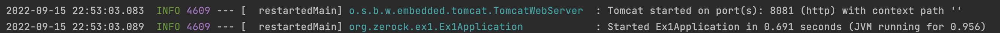

# Chapter 01 프로젝트 준비

###  ✅ 스프링이란?
+ 자바 엔터프라이즈 애플리케이션 개발에 사용되는 애플리케이션 프레임워크이다.
<br>

```
애플리케이션 프레임워크 
--> 애플리케이션 개발이 빠르고 효율적으로 할 수 있도록 애플리케이션 바탕이
되는 틀과 공통 프로그래밍 모델, 기술 API 등을 제공하는 역할 
```


### 스프링 핵심 3가지
1. #### Ioc/DI
   + 스프링은 유연하고 확장성이 뛰어난 코드를 만들수 있게 도와주는 객체 지향 설계 원칙과 디자인 패턴의 핵심 원리를 담고 있는 Ioc/DI 프레임워크 근간으로 삼고 있다.
   + 스프링이 직접 제공하는 모든 기술과 API 심지어 컨테이너도 Ioc/DI 방식으로 작성되어 있다.
   <br> ==> 스프링을 효율적으로 사용하려면 Ioc/DI 방식을 제대로 이해해야 한다.
2. #### 서비스 추상화
3. #### AOP 
    + IoC / DI 오브젝트 생명주기와 의존관계에 대한 프로그래밍 모델 <br>


###  ✅ 스프링부트란?


###  ✅ 스프링 부트 실행 시 배너 커스텀 방법
+  스프링 부트를 실행할때 별도의 banner.txt 없으면 스프링에 제공하는 기본 배너가 출력된다.


+ resources 폴더 하위에 banner.txt 파일 추가 <br>


### ✅ 프로젝트 실행 에러
+ 책에서 프로젝트 실행 에러 발생시 대부분 Gradle 환경 설정 문제 또는 Tomcat 포트 충돌이라고 소개하고 있다.
+ gradle 환결성정 문제는 개발 환경 컴퓨터 이름이 한글이 들어갈 경우 주로 윈도우에서 많이 발생하는거 같다.
+ 포트 충돌같은 경우 실행 이전에 애플리케이션 정상적으로 종료하지 못했거나 아직 실행중인 상태에서 한번 더 어플리케이션을 실행 할 경우 발생한다.
<br> 해결 방법은 이미 사용중인 8080 포트 서비스를 종료하거나 실행할 어플리케이션 포트를 바꿔 실행하면 된다. <br>

