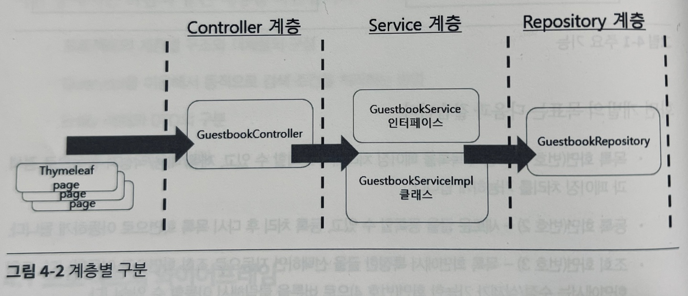
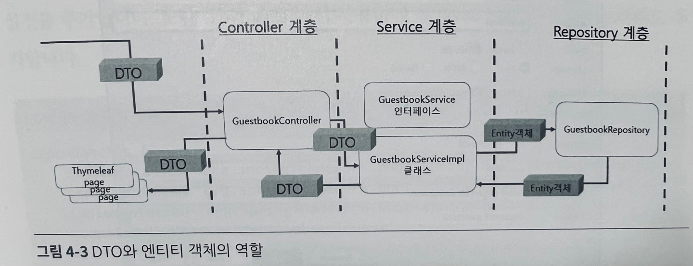
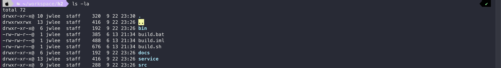
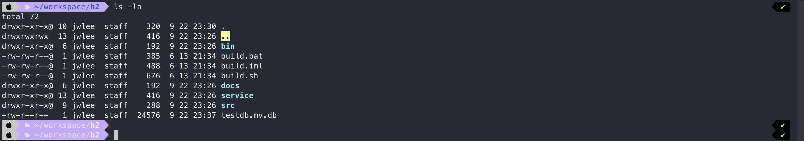
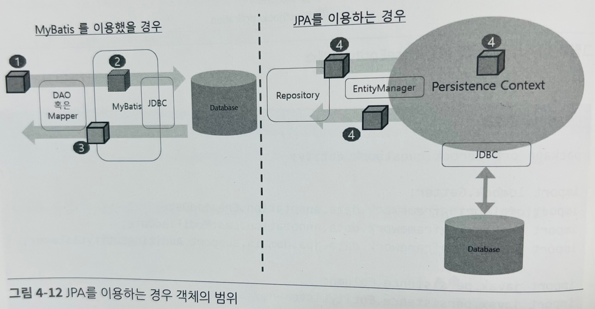

# 프로젝트 구조 만들기

---

### ✅ 4.1 프로젝트 와이어프레임
+ 프로젝트를 구성할 때 가장 먼저 와이어프레임(화면 설계서)을 제작하고 진행하는것이 좋다.
+ 와이어프레임을 제작하면 화면의 URI와 전달되는 파라미터 등을 미리 결정할 수 있고, 데이터베이스 설계에 필요한 컬럼들을 미리
파악하는데도 도움이 된다.

### 🔻 API 정의
| 기능      | URL                 | GET/POST | 기능 설명      | RedirectURL   |
|---------|---------------------|----------|------------|---------------|
| 목록      | /guestbook/list     | GET      | 목록/페이징/검색  |               |
| 등록      | /guestbook/register | GET      | 입력 화면      | |
|         | /guestbook/register | POST     | 등록처리       | /guestbook/list|
| 조회      | /guestbook/read | GET | 조회화면 | |
|수정 | /guestbook/modify | GET | 수정/삭제 가능 화면 |  |
| | /guestbook/modify | POST | 수정처리 | /guestbook/read|
|삭제 | /guestbook/remove | POST | 삭제처리 | /guestbook/list|

### 🔻 프로젝트 구조

1. 브라우저에서 들어오는 Request는 GuestbookController라는 객체로 처리
2. GuestbookController는 GuestbookService 타입을 주입받는 구조로 만들고, 이를 이용해서 원하는 작업을 처리
3. GuestbookRepository는 Spring Data JPA를 이용해서 구성하고, GuestbookServiceImpl 클래스에 주입해서 사용
4. 마지막 결과는 Thymeleaf를 이용해서 레이아웃 템플릿을 활용해서 처리



5. 브라우저에서 잔달되는 Request는 GuestbookController에서 DTO의 형태로 처리
6. GuestbookRepository는 엔티티 타입을 이용하므로 중간에 Service 계층에서는 DTO의 엔티티의 변환을 처리

### 🔻 프로젝트 라이브러리
+ Spring Boot DevTools
+ Spring Data JPA
+ Spring Web
+ Lombok
+ Thymeleaf

### 🔻 H2 데이터 베이스 설치
공식홈페이지 접속하여 사용하고자 하는 OS 버전 h2 데이터베이스 zip 파일을 다운받는다.
https://www.h2database.com/html/main.html
(필자는 Mac 으로 진행)

+ 압축해제 후 해당 폴더에 접근
+ ./bin/h2.sh 명령어를 사용해 h2 데이터베이스 서버 실행
+ localhost:8082 로 접속하면 h2 웹 콘솔로 진입이 가능하다.


+ ```최초 사용시 데이터 베이스를 만들어야 한다.```
+ jdbc:h2:~/workspace/h2/testdb --> 필자는 홈 다운받았던 h2 디렉토리 안에 testdb를 생성


+ 생성 후 해당 디렉토리에서 다시 조회하면 testdb.mv.db 파일이 생성되며 이안에 h2 데이터 베이스 정보가 담겨져 있다.

### 🔻 Spring Boot + h2 연결

#### Gradle 에 h2 드라이버 추가
``` groovy
implementation 'com.h2database:h2'
```
#### application.yaml 파일에 config 추가
```
spring:
  datasource:
    url: jdbc:h2:tcp://localhost/~/workspace/h2/testdb;MODE=MYSQL
    username: sa
    password:
    driver-class-name: org.h2.Driver
  jpa:
    properties:
      hibernate:
        format_sql: true
        dialect: org.hibernate.dialect.MySQL5InnoDBDialect
    show-sql: true
    hibernate:
      ddl-auto: update
```

### 🔻 JPA 

+ JPA는 JPA만의 고유한 메모리 공간(영속성 컨텍스트)을 이용해서 엔티티 객체들을 관리함
+ MyBatis를 이용하는 경우에는 SQL을 위해서 전달되는 객체는 모두 SQL 처리가 끝난 후에는 어떻게 되든 상관이 없는 객체들인 반면
JPA에서 사용하는 엔티티 객체들은 영속성 컨텍스트라는 곳에서 관리되는 객체
+ JPA 방식에서는 해당 엔티티 객체는 유지되고 필요할 때 꺼내서 재사용하는 방식이다.

### 🔻 QueryDSL 설정
+ Querydsl을 이용하면 코드 내부에서 상황에 맞는 쿼리를 생성할 수 있지만 이를 위해서는 작성된 엔티티 클래스를 그대로 이용하는 것이 아닌 'Q도메인'이라는 것을 이용해야 한다.
+ Querydsl 라이브러리를 이용해서 엔티티 클래스를 Q도메인 클래스로 변환하는 방식을 이용

#### 라이브러리 추가
+ plugins 항목에 querydsl 관련 부분을 추가
+ build.gradle 에 dependencies 항목에 필요한 라이브러리 추가
+ Gradle에서 사용할 추가적인 task 추가

#### build.gradle 설정 추가 
```
buildscript {
    ext {
        queryDslVersion = "5.0.0"
    }
}

plugins {
    id 'com.ewerk.gradle.plugins.querydsl' version '1.0.10'
}

configurations {
    compileOnly {
        extendsFrom annotationProcessor
    }
}

dependencies {
    implementation "com.querydsl:querydsl-jpa:${queryDslVersion}"
    annotationProcessor "com.querydsl:querydsl-apt:${queryDslVersion}"
}

def querydslDir = "$buildDir/generated/querydsl"
querydsl {
    jpa = true
    querydslSourcesDir = querydslDir
}

sourceSets {
    main.java.srcDir querydslDir
}

configurations {
    querydsl.extendsFrom compileClasspath
}

compileQuerydsl {
    options.annotationProcessorPath = configurations.querydsl
}
```
``` java
// GuestbookRepository 인터페이스
public interface GuestbookRepository extends JpaRepository<Guestbook, Long>, QuerydslPredicateExecutor<Guestbook> {
}
```

### 🔻 수정시간 테스트
+ 엔티티 클래스는 가능하면 setter 메소드를 만들지 않는것을 권장함
<br> --> setter를 선언해서 사용하게되면 JPA를 관리하는 쪽이 복잡해질 우려가 있기 때문에 가능하면 최소한의 수정이 가능하도록 하는 것을 권장


### 🔻 단일 항목 검색테스트 - QueryDSL 동적 검색
```java
@Test
public void queryDSL_테스트1() {

    Pageable pageable = PageRequest.of(0, 10, Sort.by("gno").descending());
    QGuestbook qGuestbook = QGuestbook.guestbook;           // 1

    String keyword = "1";

    BooleanBuilder builder = new BooleanBuilder();          // 2
    BooleanExpression expression = qGuestbook.title.contains(keyword);      // 3
    builder.and(expression);                                // 4

    Page<Guestbook> result = guestbookRepository.findAll(builder, pageable);    // 5
    result.stream().forEach(guestbook -> {
        System.out.println(guestbook);
    });
}
```
1. 가장 먼저 동적으로 처리하기 위해서 Q도메인 클래스를 얻는다.
<br> Q도메인 클래스를 이용하면 엔티티 클래스에 선언된 title, content같은 필드들을 변수로 활용할 수 있다.
2. BooleanBuilder는 where문에 들어가는 조건들을 넣어주는 컨테이너
3. 원하는 조건은 필드 값과 결합해서 생성  BooleanBuilder 안에 들어가는 값은 
`com.querydsl.core.types.Predicate 타입`이어야 한다.(Java에 있는 Predicate 타입이 아니므로 주의❗️)
4. 만들어진 조건은 where문에 and나 or같은 키워드와 결합
5. BooleanBuilder는 GuestbookRepository에 추가된 QuerydslPredicateExcutor 인터페이스의 findAll()을 사용

### 🔻 다중 항목 검색테스트 - QueryDSL 동적 검색
```java
@Test
public void queryDSL_다중항목_테스트2() {

    Pageable pageable = PageRequest.of(0, 10, Sort.by("gno").descending());
    QGuestbook qGuestbook = QGuestbook.guestbook;
    
    String keyword = "1";
    
    BooleanBuilder builder = new BooleanBuilder();
    BooleanExpression exTitle = qGuestbook.title.contains(keyword);
    BooleanExpression exContent = qGuestbook.content.contains(keyword);
    
    BooleanExpression exAll = exTitle.or(exContent);        // 1
    builder.and(exAll);                                     // 2
    builder.and(qGuestbook.gno.gt(0L));                     // 3
    
    Page<Guestbook> result = guestbookRepository.findAll(builder, pageable);
    
    result.stream().forEach(guestbook -> {
        System.out.println(guestbook);
    });
}
```
1. Boolean Expression 결합 부분 exTitle과 exContent
2. BooleanBuilder 추가
3. gno가 0보다 크다. 조건을 추가

### 🔻 서비스 계층과 DTO
+ 실제 프로젝트를 작성할 경우에 엔티티 객체를 영속 계층 바깥쪽에서 사용하는 방식 보다는 DTO(Data Transfer Object)를 이용하는 방식 권장
+ DTO는 엔티티 객체와 달리 각 계층끼리 주고받는 우편물이나 상자의 개념이며, 순수하게 데이터를 담고 있다는 점에서는 엔티티 객체와 유사하지만,
목적 자체가 데이터의 전달이므로 읽고, 쓰는것이 모두 허용되는 점이 가능하고 일회성으로 사용되는 성격이 강함
+ JPA를 이용하게 되면 엔티티 객체는 단순히 데이터를 담는 객체가 아니라 실제 데이터베이스와 관련 있고, 내부적으로 엔티티 매니저(entity manager)가 관리하는 객체
+ DTO가 일회성으로 데이터를 주고받는 용도로 사용하는 것과 달리 생명주기도 전혀 다르기 때문에 분리해서 처리하는것을 권장3

### 🔻 DTO를 엔티티로 변환하기
```
Java8버전부터 인터페이스의 실제 내용을 가지는 코드를 default 키워도로 생성할 수 있다.
이를 이용하면 기존에 추상 클래스를 통해서 전달해야 하는 실제 코드를 인터페이스에 선언할 수 있습니다.
인터페이스 -> 추상 클래스 -> 구현 클래스 형태로 구현되던 방식에서 추상 클래스를 생략하는것이 가능해짐
```
``` java
// GuestbookService 인터페이스 
public interface GuestbookService {
    Long register(GuestbookDTO dto);

    default Guestbook dtoToEntity(GuestbookDTO dto) {
        Guestbook entity = Guestbook.builder()
                .gno(dto.getGno())
                .title(dto.getTitle())
                .content(dto.getContent())
                .writer(dto.getWriter())
                .build();

        return entity;
    }
}
```
``` java
// GuestbookServiceImpl 클래스
@Service
@Log4j2
@RequiredArgsConstructor
public class GuestbookServiceImpl implements GuestbookService{

    private final GuestbookRepository repository;

    @Override
    public Long register(GuestbookDTO dto) {

        log.info("DTO------------------------");
        log.info(dto);

        Guestbook entity = dtoToEntity(dto);
        log.info(entity);

        repository.save(entity);
        return entity.getGno();
    }
}
```
```
PageResultDTO는 List<DTO> 타입으로 DTO 객체들을 보관한다.
Page<Entity>의 내용물중에서 엔티티 객체를 DTO로 변환하는 기능이 필요한다.
가장 일반적인 형태는 추상 클래스를 이용해서 이를 처리해야 하는 방식이지만 이 경우 매번 새로운 클래스가 필요하다는 단점이 있다.
엔티티 객체의 DTO 변환은 서비스 인터페이스에 정의한 메소드(entityToDto())와 별도의 Function 객체로 만들어서 처리
```
### 🔻 컨트롤러와 화면에서의 목록 처리
```
Spring Data JPA를 이용할 때는 @PageableDefault라는 어노테이션 Pageable 타입을 이용할 수도 있고
application.properties에 0이 아닌 1부터 페이지 번호를 받을수 있게 처리할 수도 있다.
예제에서 사용하지 않는 것은 나중에 검색 조건등과 같이 추가로 전달되어야 데이터가 많을 경우 오히려 더 복잡하게 동작할 여지가 있기 때문이다.
```


