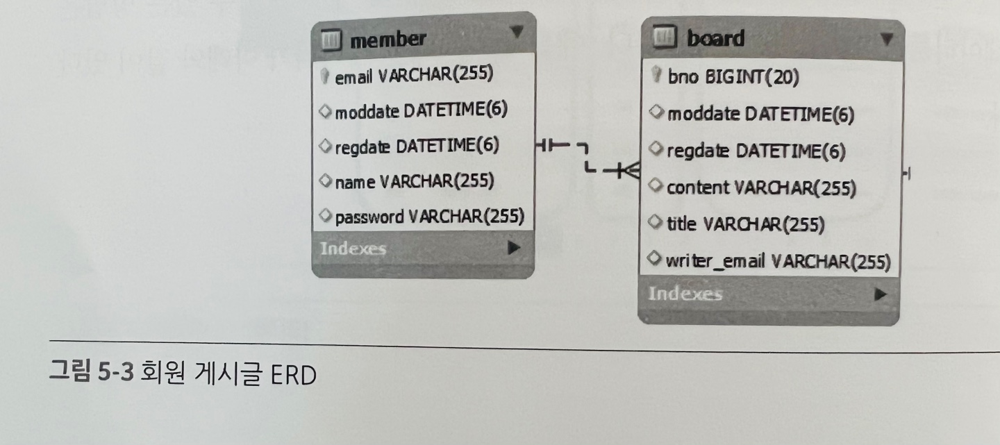
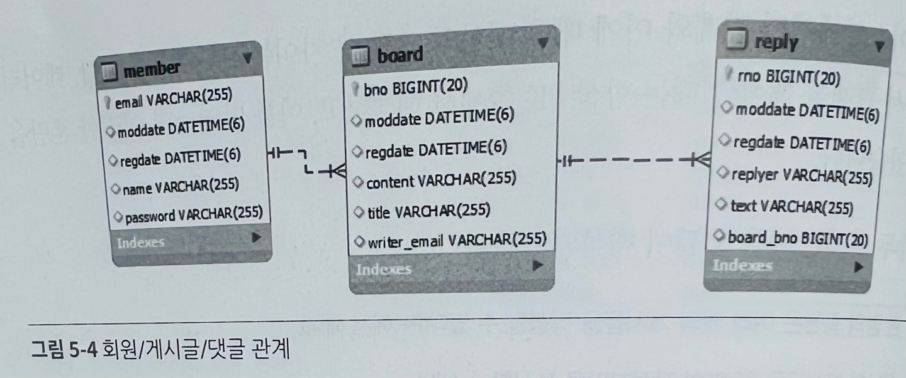

# JPA 연관관계

---

### ✅ 5.1 연관관계와 관계형 데이터베이스 설계
+ 관계형 데이터베이스에서는 개체(entity)간의 '관계(relation)'라는 것에 고민하게 된다.
+ 일대일(1:1), 일대다(1:N), 다대일(N:1), 다대다(M:N)의 관계를 이용해서 데이터 연관관계를 표현한다.
+ 이 표현에서 가장 중요한건 PK(주키, Primary Key)와 FK(외래키, Foreign Key)를 어떻게 설정해서 사용하는지 설정

#### '회원' 과 '게시글'의 관계를 생각할때 다음과 같이 나타낼 수 있다.
+ 한 명의 회원은 여러 게시글을 작성할 수 있다.
+ 하나의 게시글은 한 명의 회원에 의해서 작성된다.

```
위의 두 문장을 볼때 같은 말이라고 생각할 수 있지만 실제로 데이터베이스 모델링을 할 때는 조금 상황이 다르다.
두번째 문장인 '하나의 게시글은 한 명의 회원에 의해서 작성된다.' => 일대일 관계처럼 보일 수 있다.
이부분은 실제 테이블 설계에는 맞지 않다.
```

예를들어 회원 데이터 쪽이 일(one)이고, 게시글 데이터는 동일한 회원 아이디가 여러 번 나오고 있으므로 '다(many)'로 
판단하고 다음과 같이 ERD를 작성하게 된다.



데이터베이스상에서의 관계와 이에 대한 해석의 가장 큰 차이는 'PK'에 있습니다. 
<br> 데이터베이스에서 관계를 해석할 때는 항상 PK쪽에서 해석하고, 이를 반영하면 혼란을 줄일 수 있다.
즉, 다음과 같이 해석되어야 한다.

+ 한 명의 회원은 여러 개의 게시글을 작성할 수 있다(PK에서 해석)
+ 하나의 게시글은 한 명의 작성자만을 표시할 수 있다.

#### '게시글'과 '댓글'의 관계
+ 하나의 게시글은 여러 개의 댓글을 가질 수 있다.
+ 하나의 댓글은 하나의 게시글에 속한다.

위의 관계 역시 `PK를 고려하지 않고 해석하면 두 번째 문장은 잘못된 설계를 만들게 된다.`
<br> 게시물과 댓글의 관계는 1:N(일대다)이고, 댓글과 게시글의 입장에서는 N:1(다대일)의 관계로 해석되어야 한다.

#### ✅ 5.1.1 연관관계와 관계형 데이터베이스 설계
+ JPA를 이용하여 연관관계를 해석할 때는 PK를 기준으로 잡고, 데이터베이스를 모델링하는 방식으로 구성
+ '회원, 게시글, 댓글'의 관계를 PK를 기준으로 설계하면 다음과 같다.



회원이 있어야만 게시글을 작성할 수 있으므로, 회원 테이블을 먼저 설계하고 게시글을 작성할 때는 특정 회원과의 관계를 설정해 주어야 한다.
<br> 댓글은 게시글이 있어야만 작성할 수 있으므로 게시글을 우선 설계하고, 댓글 테이블이 게시글을 FK로 작성
<br> FK를 기준으로 위의 관계를 해석하면 다음과 같다
+ 게시물(board)은 회원(member)과 다대일(N:1)의 관계이다.
+ 댓글(reply)은 게시물(board)과 다대일(N:1)의 관계이다.

관계형 데이터베이스에서는 PK와 FK만으로 표현되었던 관계가 객체지향으로 옮겨지면 위와 같이 다양한 선택지가 존재하게 된다.
<br> 흔히 '단방향 참조, 양방향 참조'라고 표현하기도 하는데 실제 데이터베이스에는 양방향이라는 말은 존재하지 않기 때문에 객체지향에서만 겪는 문제라고 볼수 있다.

1. 회원 엔티티가 게시물 엔티티들을 참조하게 설정해야 하는가?
2. 게시물 엔티티에서 회원 엔티티를 참조하게 설정해야 하는가?
3. 회원, 게시물 엔티티 객체 양쪽에서 서로를 참조하게 설정해야 하는가?

위의 3가지 선택지에서 가장 간단한 시작은 객체지향보다는 관계형 데이터베이스 모델링을 위주로 해서 구성하는 것이 편리하다.
FK를 사용하는 엔티티가 PK를 가진 엔티티를 참조하는 구조로 설계하면 데이터베이스와 동일한 구조가 되기 때문에 관계를 이해하는 것도 편하고
자동으로 테이블이 생성될 때도 유용하다.

#### ✅ 5.2.2 @ManyToOne과 Eager/Lazy loading
@ManyToOne 어노테이션이 선언된 연관관계 주인인 엔티티를 조회할때 PK 쪽 엔티티도 같이 가져온다.
```
@Test
public void 게시글조회테스트_1() {
    Optional<Board> result = boardRepository.findById(100L);        // 데이터베이스에 존재하는 번호
    Board board = result.get();

    System.out.println(board);
    System.out.println(board.getWriter());
}
```
```
select
        board0_.bno as bno1_0_0_,
        board0_.moddate as moddate2_0_0_,
        board0_.regdate as regdate3_0_0_,
        board0_.content as content4_0_0_,
        board0_.title as title5_0_0_,
        board0_.writer_email as writer_e6_0_0_,
        member1_.email as email1_1_1_,
        member1_.moddate as moddate2_1_1_,
        member1_.regdate as regdate3_1_1_,
        member1_.name as name4_1_1_,
        member1_.password as password5_1_1_ 
    from
        board board0_ 
    left outer join
        member member1_ 
            on board0_.writer_email=member1_.email 
    where
        board0_.bno=?
```
위의 테스트 코드를 실행하면 내부적으로 `left outer join` 처리가 된것을 확인할 수 있다.